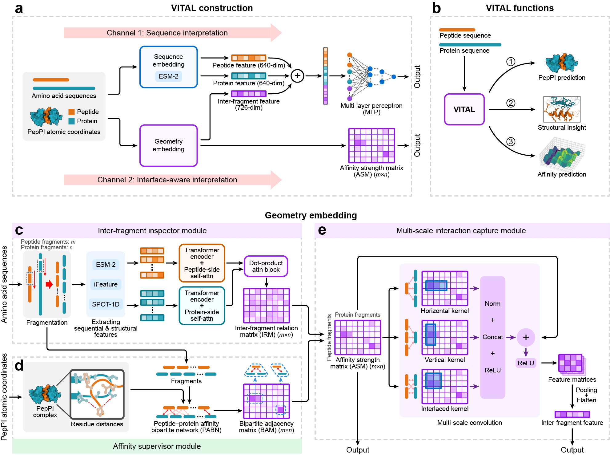

# VITAL: *A Deep Learning Framework for Affinity Prediction and Interface Mapping of Peptide–Protein Interactions*
VITAL is a deep learning framework that co-learns local structural geometries and global sequence contexts to enable quantitative peptide–protein interaction (PepPI) characterization.

## VITAL


## Contents
<details open><summary><b>Table of contents</b></summary>

- [Code organization](#code-org)
- [Requirement](#require)
- [Usage](#usage)
    - [Installation](#install)
    - [Feature extraction](#feature)
    - [Inference](#inference)
- [Web server](#server)
</details>

## Code organization <a name="code-org"></a>
* `ckpts/` - Pretrained model checkpoints
* `datasets/` - Example datasets used for training and evaluation?
* `data_processing/` - Tools and utilities for feature extraction and preprocessing
* `model/` - Contains the model file for inference
* `feature_dic.py` - Main script for generating feature dictionariesrun_feature.sh
* `parse_feature_dict.py` - Script for parsing and organizing extracted feature dictionaries
* `prediction.py` - Main script for running inference
* `run_feature.sh` - Shell script for executing the full feature extraction pipeline
* `run_prediction.sh` - Shell script for performing model prediction

## Requirement <a name="require"></a>
All experiments were conducted using PyTorch 1.12.1 and Python 3.9 on a server equipped with an NVIDIA GeForce RTX 3090 GPU (CUDA 11.4).

## Usage <a name="usage"></a>
### Installation <a name="install"></a>
Follow the steps below to set up the environment and install all dependencies.

#### 1 Clone the repository

```text
git clone https://github.com/BADDxmu/VITAL.git
cd VITAL
```

#### 2 Create the conda environment

We provide an `env.yml` file for reproducible environment setup.

```text
conda env create -f env.yml
conda activate VITAL
```
#### 3 Download pretrained model
***Important notice on third-party tools**: Users are now required to install the corresponding tools independently from their official repositories, and configure the paths accordingly. This does not affect the reproducibility of our results, as all feature extraction strictly follows the official implementations.*

##### 3.1 Install iFeature
```text
cd data_processing
git clone https://github.com/Superzchen/iFeature.git
cp utils/AAINDEX.py iFeature/codes
cp utils/HQI18.txt iFeature/data
cd ..
```

##### 3.2 Install SPOT-1D-Single
```text
cd data_processing # Skip this step if you are already in this directory.
git clone https://github.com/jas-preet/SPOT-1D-Single.git SPOT_1D_Single
cp utils/spot1d_single2.py SPOT_1D_Single
cp utils/__init__.py SPOT_1D_Single
cp utils/ dataset_inference.py  SPOT_1D_Single/dataset
cp utils/main.py SPOT_1D_Single
cd ..
```

**Note**: If you encounter the `mkl-service_error` error, please ensure the following environment variables are set:
    ```text
    export MKL_THREADING_LAYER=GNU
    export MKL_SERVICE_FORCE_INTEL=1
    ```

##### 3.3 Install ESM and download pretrained models
```text
cd data_processing # Skip this step if you are already in this directory.
git clone https://github.com/facebookresearch/esm.git ESM-2
cp utils/extract.py ESM-2/scripts
```

To download the pretrained ESM-2 model weights, run the following commands:
```
# Ensure you are in the `data_processing` directory
mkdir ESM-2/checkpoints
cp utils/download_weights.sh ESM-2/scripts
cd ESM-2
bash scripts/download_weights.sh
```

**Note**: If `aria2c` is not installed, you may download the model weights (`esm2_t30_150M_UR50D-contact-regression.pt` and `esm2_t30_150M_UR50D.pt`) manually from the official [ESM repository](https://github.com/facebookresearch/esm) and place them in the `checkpoints/` directory.

### Feature extraction <a name="feature"></a>
Before using VITAL for inference, you need to generate all required features.  
1. Prepare your **peptide and protein sequences** and save them as **FASTA files**.
2. Create a pair list file specifying peptide–protein pairs for prediction.
Each line should contain one peptide ID and one protein ID, separated by a **tab** (\t), as shown below:
   
```text
peptide1    protein1
peptide2    protein2
...
```

3. Run the full feature extraction pipeline:

```text
bash run_feature.sh
```

Or run it manually if you wish to modify default arguments via command line:

```text
python feature_dic.py \
    --load_list ./datasets/example_data/example_list \
    --load_fasta ./datasets/example_data/example_fasta/ \
    --save_path ./datasets/example_feature/
```
* `--load_list` specifies the peptide–protein pair list file.
Each line should contain one peptide ID and one protein ID, separated by a tab character (\t).
* `--load_fasta` specifies the directory containing FASTA files for both peptides and proteins.
The sequence identifiers must exactly match those used in the pair list.
* `--save_path` specifies the output directory where all extracted features and processed feature dictionaries will be stored.
  
The script will:
* Generate sequence-based and structure-related features
* Save processed feature dictionaries into `./datasets/example_feature/`

### Inference <a name="inference"></a>
Run the full inference pipeline:

```text
bash run_prediction.sh
```

Or run inference manually:

```text
python prediction.py \
    --batch_input_csv ./datasets/example_feature/feature_path.csv \
    --ckpt_path ./ckpts/ \
    --device cuda:0 \
    --output ./output/prediction_results/result.json \
    --ASM_output_path ./output/ASM \
    --verbose
```

* `--batch_input_csv` specifies the input CSV file listing the paths to all extracted features.
This file is automatically generated by `feature_dic.py` and located in the directory defined by `--save_path` during feature extraction.
* `--output` specifies the path to save the final prediction results in JSON format.
* `--ASM_output_path` specifies the directory to save the predicted affinity / interaction strength matrices (ASM) for each peptide–protein pair.
* `--verbose` enables detailed logging during inference.

The inference script will:
* Load the precomputed feature dictionary
* Load the TorchScript model
* Produce prediction scores and ASM for each protein–peptide pair
* Inference results will be saved to prediction_results.csv by default.

## Web server <a name="server"></a>
You can access and use VITAL through the [VITAL-web-server](https://www.vital-peppi.online/).


